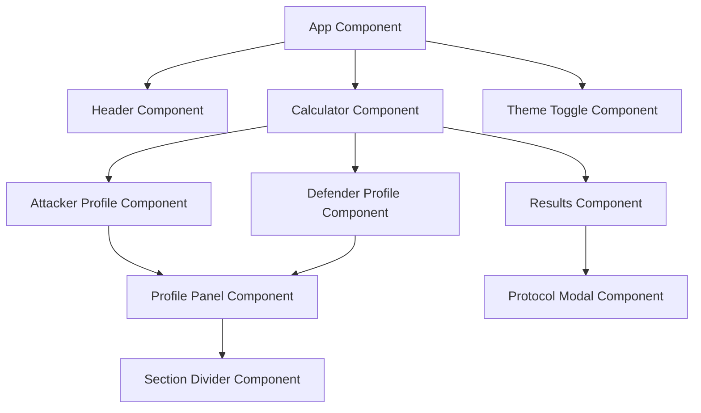

# ⚔️ Warhammer 40K Calculator

<div align="center">
  
  
  [](https://angular.io/)
  [](https://www.typescriptlang.org/)
  [](https://material.angular.io/)
  [](LICENSE)
  [](https://github.com/Jorge-GD/Wh40kcalculator)

**A comprehensive mathhammer calculator for Warhammer 40,000**

_Calculate combat probabilities, optimize tactical decisions, and master the art of war in the grim darkness of the far future._

[🚀 Live Demo](https://jorge-gd.github.io/Wh40kcalculator/) • [📖 Documentation](#documentation) • [🐛 Report Bug](https://github.com/Jorge-GD/Wh40kcalculator/issues) • [💡 Request Feature](https://github.com/Jorge-GD/Wh40kcalculator/issues)

</div>

---

## 📋 Table of Contents

- [✨ Features](#-features)
- [🎯 Quick Start](#-quick-start)
- [📦 Installation](#-installation)
- [🚀 Usage](#-usage)
- [⚙️ Development](#-development)
- [🏗️ Architecture](#-architecture)
- [📜 Available Scripts](#-available-scripts)
- [🌐 Deployment](#-deployment)
- [🛠️ Troubleshooting](#-troubleshooting)
- [🗺️ Roadmap](#-roadmap)
- [🤝 Contributing](#-contributing)
- [📄 License](#-license)

---

## ✨ Features

### 🎮 Core Functionality

- **🎯 Attacker Profiles**: Configure weapon statistics including attacks, skill, strength, AP, and damage
- **🛡️ Defender Profiles**: Set up target characteristics with saves, invulnerable saves, and special rules
- **📊 Real-time Calculations**: Instant probability calculations with interactive parameter adjustment
- **🔢 Advanced Math**: Comprehensive mathhammer engine supporting complex combat scenarios

### ⚔️ Combat Protocols

- **💥 Sustained Hits**: Automatic hit generation on critical successes
- **☠️ Lethal Hits**: Automatic wounds on critical hits
- **🔥 Devastating Wounds**: Mortal wounds on critical wound rolls
- **🎯 Anti-X Rules**: Enhanced performance against specific keywords
- **⚡ Melta Weapons**: Additional damage at close range
- **🌪️ Torrent**: Automatic hits without roll requirements
- **💀 Twin-Linked**: Re-roll hit attempts for increased accuracy

### 🎨 User Experience

- **🌙 Multiple Themes**: Chaos Dark and Imperium Light themes with immersive styling
- **📱 Responsive Design**: Optimized for desktop, tablet, and mobile devices
- **🎭 Material Design**: Clean, modern interface using Angular Material components
- **🍎 Typography**: San Francisco font system for consistent cross-platform appearance
- **🔍 Unified Icons**: Google Material Symbols for consistent visual language

---

## 🎯 Quick Start

### Prerequisites

- **Node.js** (v18 or higher) - [Download here](https://nodejs.org/)
- **npm** (v9 or higher) - Comes with Node.js
- **Git** - [Download here](https://git-scm.com/)

### Lightning Fast Setup ⚡

```bash
# Clone the repository
git clone https://github.com/Jorge-GD/Wh40kcalculator.git

# Navigate to project directory
cd Wh40kcalculator

# Install dependencies
npm install

# Start development server
npm start

# Open your browser to http://localhost:4200
```

---

## 📦 Installation

### Method 1: Standard Installation

```bash
# 1. Clone the repository
git clone https://github.com/Jorge-GD/Wh40kcalculator.git
cd Wh40kcalculator

# 2. Install dependencies
npm install

# 3. Verify installation
npm run lint
```

### Method 2: Development Setup

```bash
# 1. Fork the repository on GitHub
# 2. Clone your fork
git clone https://github.com/YOUR_USERNAME/Wh40kcalculator.git
cd Wh40kcalculator

# 3. Add upstream remote
git remote add upstream https://github.com/Jorge-GD/Wh40kcalculator.git

# 4. Install dependencies with development tools
npm install

# 5. Install Git hooks for code quality
npm run prepare

# 6. Start development with hot reload
npm run start
```

---

## 🚀 Usage

### Basic Operation

1. **Configure Attacker Profile**

   - Set weapon characteristics (Attacks, Skill, Strength, AP, Damage)
   - Enable special weapon rules (Sustained Hits, Lethal Hits, etc.)
   - Apply shooting modifiers and re-roll options

2. **Configure Defender Profile**

   - Set target characteristics (Toughness, Save, Wounds)
   - Configure invulnerable saves and special defenses
   - Apply cover and modifier effects

3. **View Results**
   - Real-time probability calculations
   - Expected damage output
   - Statistical breakdowns and analysis

### Advanced Features

#### Multiple Profiles

```typescript
// Example: Configure multiple attacker profiles
const bolterProfile = {
  attacks: '4',
  skill: 3,
  strength: 4,
  ap: 0,
  damage: '1',
};

const plasmaProfile = {
  attacks: '2',
  skill: 3,
  strength: 7,
  ap: 2,
  damage: '1',
  melta: { active: true, value: 'D3', inRange: true },
};
```

#### Theme Switching

The application supports multiple visual themes:

- **Chaos Dark**: Dark theme with bronze/brass accents
- **Imperium Light**: Light theme with imperial styling

---

## ⚙️ Development

### Technology Stack

- **Frontend Framework**: Angular 19.2
- **UI Components**: Angular Material 19.2
- **Language**: TypeScript 5.7
- **State Management**: NgRx Store 19.2
- **Styling**: SCSS with CSS Custom Properties
- **Testing**: Jasmine + Karma
- **Code Quality**: ESLint + Prettier
- **Git Hooks**: Husky

### Development Workflow

#### 1. Start Development Server

```bash
npm start
# or
ng serve
```

- Opens `http://localhost:4200`
- Auto-reloads on file changes
- Source maps enabled for debugging

#### 2. Code Quality Checks

```bash
# Run linting
npm run lint

# Auto-fix linting issues
npm run lint:fix

# Format all files
npm run format
```

#### 3. Testing

```bash
# Run unit tests
npm test

# Run tests with coverage
npm run test:ci

# Run tests in watch mode
ng test --watch
```

#### 4. Building

```bash
# Development build
ng build

# Production build
ng build --configuration production

# Build with specific base href for deployment
ng build --base-href /Wh40kcalculator/
```

---

## 🏗️ Architecture

### Project Structure

```
src/
├── app/
│   ├── components/           # UI Components
│   │   ├── attacker-profile/ # Attacker configuration
│   │   ├── defender-profile/ # Defender configuration
│   │   ├── calculator/       # Main calculator logic
│   │   ├── results/          # Results display
│   │   ├── header/           # Application header
│   │   └── theme-toggle/     # Theme switching
│   ├── models/               # TypeScript interfaces
│   │   ├── attacker-profile.model.ts
│   │   ├── defender-profile.model.ts
│   │   └── calculation-result.model.ts
│   ├── services/             # Business logic
│   │   ├── calculation.service.ts
│   │   ├── attacker-profile.service.ts
│   │   ├── defender-profile.service.ts
│   │   └── theme.service.ts
│   ├── state/                # NgRx state management
│   ├── styles/               # Shared styling
│   │   ├── design-tokens.scss
│   │   ├── mixins.scss
│   │   └── utilities.scss
│   └── themes.scss           # Theme definitions
├── assets/                   # Static assets
└── styles.scss              # Global styles
```

### Component Architecture



### Data Flow

1. **User Input** → Component State
2. **Component State** → Service Layer
3. **Service Layer** → Calculation Engine
4. **Calculation Engine** → Results
5. **Results** → UI Display

---

## 📜 Available Scripts

| Command            | Description              | Usage       |
| ------------------ | ------------------------ | ----------- |
| `npm start`        | Start development server | Development |
| `npm run build`    | Build for production     | Deployment  |
| `npm test`         | Run unit tests           | Testing     |
| `npm run test:ci`  | Run tests with coverage  | CI/CD       |
| `npm run lint`     | Check code quality       | Code Review |
| `npm run lint:fix` | Auto-fix lint issues     | Development |
| `npm run format`   | Format all files         | Code Style  |
| `npm run deploy`   | Deploy to GitHub Pages   | Deployment  |
| `npm run prepare`  | Install Git hooks        | Setup       |

### Custom Angular CLI Commands

```bash
# Generate new component
ng generate component components/new-feature

# Generate new service
ng generate service services/new-service

# Generate new model
ng generate interface models/new-model

# Run specific test suite
ng test --include="**/calculator.component.spec.ts"

# Analyze bundle size
ng build --stats-json
npm install -g webpack-bundle-analyzer
webpack-bundle-analyzer dist/mathhammer-ng/stats.json
```

---

## 🌐 Deployment

### GitHub Pages (Recommended)

1. **Automated Deployment**

```bash
npm run deploy
```

2. **Manual Deployment**

```bash
# Build with correct base href
ng build --base-href /Wh40kcalculator/

# Deploy to GitHub Pages
npx gh-pages -d dist/mathhammer-ng
```

3. **GitHub Actions** (Future Implementation)

```yaml
# .github/workflows/deploy.yml
name: Deploy to GitHub Pages
on:
  push:
    branches: [main]
jobs:
  deploy:
    runs-on: ubuntu-latest
    steps:
      - uses: actions/checkout@v2
      - uses: actions/setup-node@v2
      - run: npm install
      - run: npm run build
      - uses: peaceiris/actions-gh-pages@v3
```

### Alternative Hosting Options

- **Netlify**: Drag and drop `dist/` folder
- **Vercel**: Connect GitHub repository
- **Firebase Hosting**: `firebase deploy`
- **Surge.sh**: `surge dist/`

---

## 🛠️ Troubleshooting

### Common Issues

#### Build Failures

**Issue**: Font loading errors

```bash
# Error: Inlining of fonts failed
```

**Solution**: Check internet connectivity or build offline

```bash
ng build --configuration production --extract-css=false
```

**Issue**: Memory errors during build

```bash
# Error: JavaScript heap out of memory
```

**Solution**: Increase Node.js memory limit

```bash
export NODE_OPTIONS="--max-old-space-size=8192"
npm run build
```

#### Development Issues

**Issue**: Port already in use

```bash
# Error: Port 4200 is already in use
```

**Solution**: Use different port

```bash
ng serve --port 4201
```

**Issue**: Module not found errors

```bash
# Error: Module not found
```

**Solution**: Clear cache and reinstall

```bash
rm -rf node_modules package-lock.json
npm install
```

#### Testing Issues

**Issue**: Chrome browser not found

```bash
# Error: Chrome browser not found
```

**Solution**: Install Chrome or use headless mode

```bash
ng test --browsers=ChromeHeadless
```

### Performance Optimization

```bash
# Analyze bundle size
ng build --stats-json
npx webpack-bundle-analyzer dist/mathhammer-ng/stats.json

# Enable source maps for debugging
ng build --source-map

# Optimize for production
ng build --configuration production --optimization
```

---

## 🗺️ Roadmap

### 📅 Version 1.1 (Q2 2024)

- [ ] **Enhanced Combat Rules**

  - [ ] Indirect Fire protocols
  - [ ] Feel No Pain mechanics
  - [ ] Overwatch calculations
  - [ ] Psychic phase integration

- [ ] **User Experience Improvements**
  - [ ] Profile save/load functionality
  - [ ] Battle report generation
  - [ ] Export results to PDF
  - [ ] Keyboard shortcuts

### 📅 Version 1.2 (Q3 2024)

- [ ] **Advanced Features**

  - [ ] Army-wide buff calculations
  - [ ] Stratagem integration
  - [ ] Multi-unit combat scenarios
  - [ ] Turn sequence simulation

- [ ] **Technical Improvements**
  - [ ] Progressive Web App (PWA)
  - [ ] Offline functionality
  - [ ] Performance optimizations
  - [ ] Accessibility improvements (WCAG 2.1)

### 📅 Version 2.0 (Q4 2024)

- [ ] **Major Features**

  - [ ] Kill Team support
  - [ ] Competitive play statistics
  - [ ] Community profile sharing
  - [ ] Mobile app (Ionic/Capacitor)

- [ ] **Integration & APIs**
  - [ ] Battlescribe integration
  - [ ] Wahapedia API connection
  - [ ] Tournament result analysis
  - [ ] Social features

### 🔮 Future Possibilities

- [ ] **Multi-Game Support**

  - [ ] Age of Sigmar calculator
  - [ ] Horus Heresy rules
  - [ ] Kill Team specialized version

- [ ] **Advanced Analytics**
  - [ ] Machine learning predictions
  - [ ] Meta analysis tools
  - [ ] Historical data tracking
  - [ ] Competitive insights

---

## 🤝 Contributing

We welcome contributions from the Warhammer 40K community! Please see our [Contributing Guidelines](CONTRIBUTING.md) for details.

### Quick Contribution Guide

1. **Fork** the repository
2. **Create** a feature branch (`git checkout -b feature/amazing-feature`)
3. **Commit** your changes (`git commit -m 'Add amazing feature'`)
4. **Push** to the branch (`git push origin feature/amazing-feature`)
5. **Open** a Pull Request

### Code Style Guidelines

- Follow the existing TypeScript/Angular style
- Use meaningful component and variable names
- Add JSDoc comments for public methods
- Write unit tests for new features
- Ensure accessibility compliance

### Reporting Issues

When reporting issues, please include:

- Browser and version
- Operating system
- Steps to reproduce
- Expected vs actual behavior
- Screenshots (if applicable)

---

## 📄 License

This project is licensed under the MIT License - see the [LICENSE](LICENSE) file for details.

### Legal Notice

This project is not affiliated with or endorsed by Games Workshop. Warhammer 40,000 is a trademark of Games Workshop Group PLC. This tool is created for educational and community purposes under fair use.

---

## 🙏 Acknowledgments

- **Games Workshop** - For creating the Warhammer 40,000 universe
- **Angular Team** - For the excellent framework
- **Material Design Team** - For the beautiful component library
- **The Community** - For feedback, suggestions, and support

---

<div align="center">
  <h3>⚔️ For the Emperor! ⚔️</h3>
  <p><em>In the grim darkness of the far future, there is only math.</em></p>
  
  **[⬆ Back to Top](#-warhammer-40k-calculator)**
</div>
